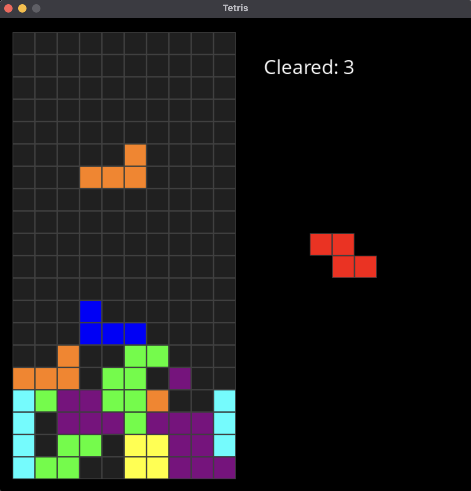
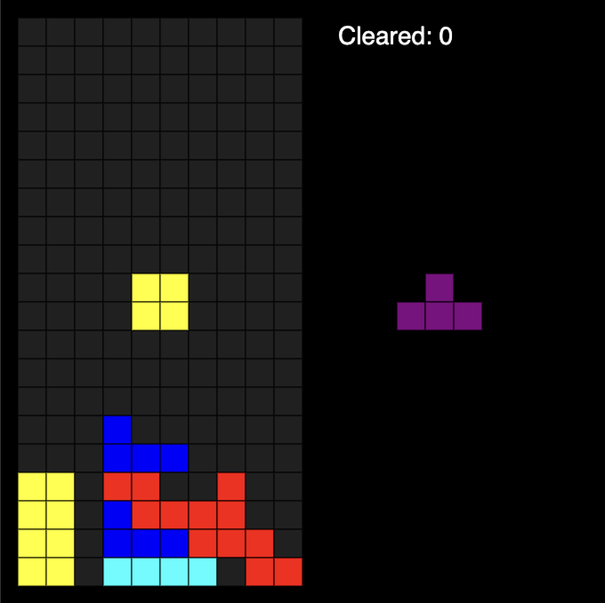

A basic tetris clone, written in Zig and compiled to both SDL2 and WASM.

Highly inspired by https://github.com/howprice/sdl2-tetris, but I have tried to go my own way as much as I could.

Zig SDL setup: https://github.com/andrewrk/sdl-zig-demo
Tetris design: https://tetris.fandom.com/wiki/SRS
C to SDL and WASM: https://github.com/tsoding/snake-c-wasm
Zig and WASM: https://github.com/sleibrock/zigtoys

Zig is great!

Requires SDL2 and SDL2_ttf installed on your system.

```bash
> zig build # Build for both platforms
> zig build run # Build both platforms and run the SDL in Debug Mode
> zig build -Dplatform=sdl # Build only SDL
> zig build -Dplatform=wasm # Build only WASM
```

With the SDL platform built, you can run the application with:
```bash
> ./zig-out/bin/tetris
```

With the WASM platform built, you can run the application with:
```bash
> python3 -m http.server 8080 # Or any other HTTP server
```

SDL:


WASM:

