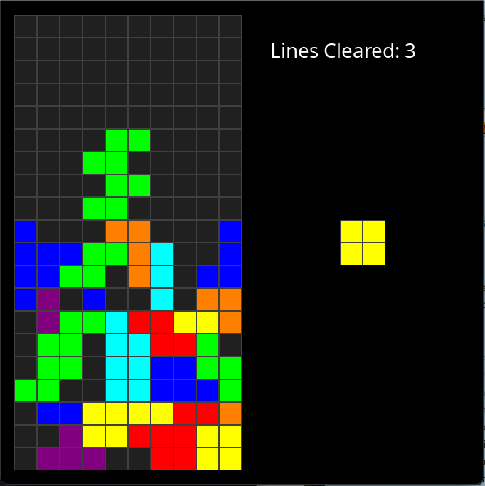

A basic tetris clone, written in Zig with SDL2 via the C FFI.

Highly inspired by https://github.com/howprice/sdl2-tetris, but I have tried to go my own way as much as I could.

Zig SDL setup: https://github.com/andrewrk/sdl-zig-demo
Tetris design: https://tetris.fandom.com/wiki/SRS

Zig is great!

Requires SDL2 and SDL2_ttf installed on your system.

```bash
> zig build run
```


